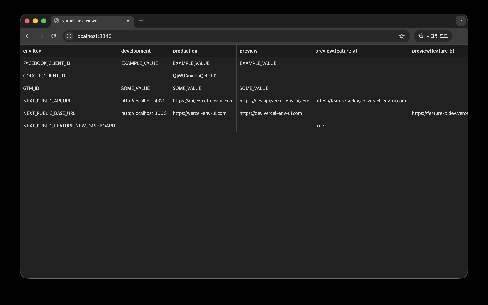

# Vercel Env Viewer

A simple tool to view Vercel project environment variables locally.

Find incorrect, missing, and unnecessary settings to ensure agile and stable development.



## Features

- Easily view environment variables by environment for Vercel projects.
  - Team-level environment variables are not supported.
  - Custom environments have not been tested yet (I don't have a Pro plan).
- Built for local execution to quickly check environment variables.

## Usage

Two environment variables are required (`.env` file is supported).

- `VERCEL_PROJECT_ID`: Vercel project ID.
- `VERCEL_API_TOKEN`: Vercel API token.

```sh
npx vercel-env-viewer
# Visit http://localhost:3345

# Change port
npx vercel-env-viewer --port 2000
# Visit http://localhost:2000
```

## Limitations

- Uses the Vercel API internally, so it's affected by API usage limits.
  - https://vercel.com/docs/limits#rate-limits
